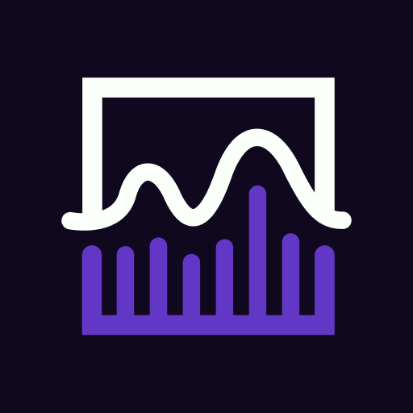

  
  <h1>Deskaide</h1>
  <strong>An aide to your desk life!</strong>

## Features

- Pomodoro (with custom duration, break time and push notification)
- Save Links (with preview and group by tags)

## Development

The app is built with Electron and React, and is bootstrapped with lerna.

### To run the app

You have to have `node.js` and `lerna` installed.

1. Clone the repo: `git clone git@github.com:deskaide/deskaide.git` or `git clone https://github.com/deskaide/deskaide.git`
2. Navigate to the app folder: `cd deskaide`
3. Install the dependencies: `npm run up`
4. Run the app: `npm start`

### To build the app

After cloning the repo and installing the dependencies, run `npm run pack`. The packaged app can be found in the `packages/server/dist` folder.

## Contribution

Suggestions and contributions are always welcome! Please first discuss changes via issue before submitting a pull request and follow our [Contribution Guide](CONTRIBUTING.md).
