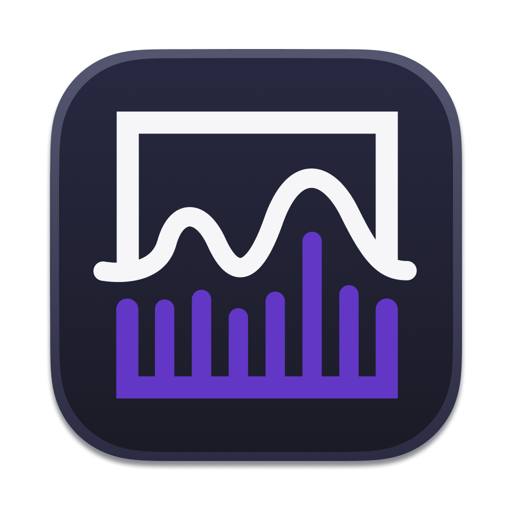
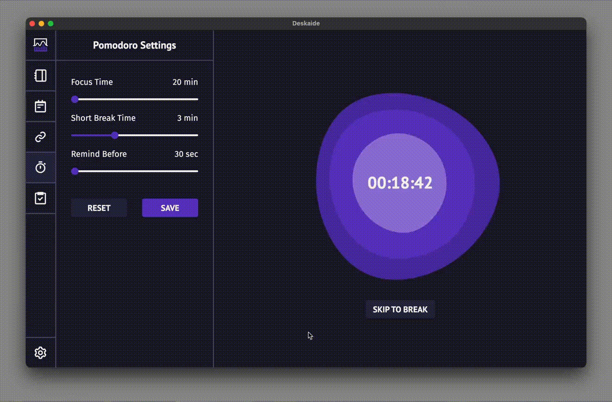
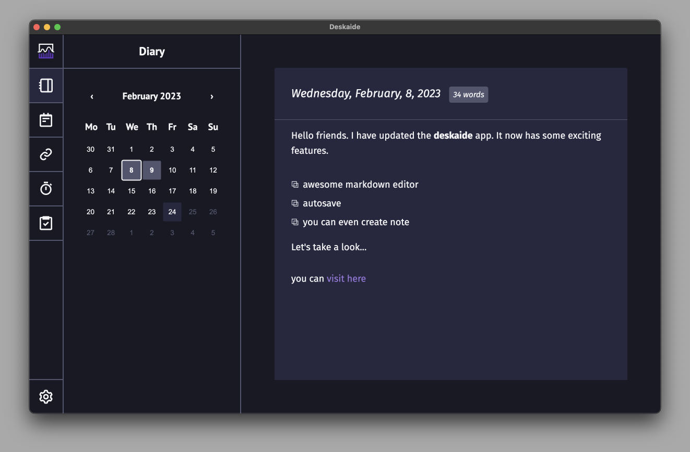
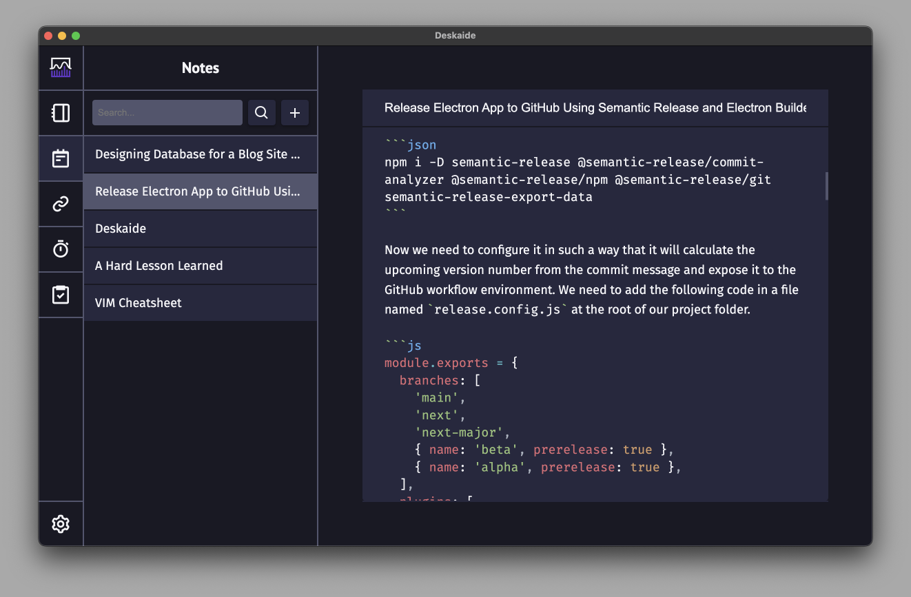

<div align="center">
  
  <h1>Deskaide</h1>
  <strong>An aide to your desk life!</strong>
</div>

### _N.B. The project is in the early stage of development. Anything can change anytime._

## Features

- [x] **Pomodoro** [_An adjustable pomodoro timer will run in the background and a overly screen (skippabale) will show up above all the active apps after the timer finishes._]


</div>
</br>

- [x] **Dairy** [_Daily important events can be saved in the the diary post section. Each day can have only one post._]

<div align="center">

</div>

- [x] **Notes** [_Any idea, writing, notes can be stored in markdown form with a title._]

<div align="center">

</div>

- [ ] **Links**
- [ ] **Todos**

## Install

You can find all the installation files on the [release page](https://github.com/deskaide/deskaide/releases).

#### macOS

As the app is not signed (due to Apple developer account cost), macOS will prevent the app from running. Please follow the instructions below to run the app.

- Intel Chips: Follow the [instructions here](https://support.apple.com/guide/mac-help/open-a-mac-app-from-an-unidentified-developer-mh40616/mac).
- Apple Chips: You can manually allow the app from privacy settings or run the following command:

```sh
sudo xattr -r -d com.apple.quarantine /Applications/Deskaide.app
```

## Development

Please follow [the instructions here](doc/development.md) to develop and run the app locally.

## Author

Shahidul Islam Majumder ([@sh4hids](https://github.com/sh4hids))

[vite]: https://github.com/vitejs/vite/
[electron]: https://github.com/electron/electron
[electron-builder]: https://github.com/electron-userland/electron-builder
[vue]: https://github.com/vuejs/vue-next
[vue-router]: https://github.com/vuejs/vue-router-next/
[typescript]: https://github.com/microsoft/TypeScript/
[spectron]: https://github.com/electron-userland/spectron
[vue-tsc]: https://github.com/johnsoncodehk/vue-tsc
[eslint-plugin-vue]: https://github.com/vuejs/eslint-plugin-vue
[cawa-93-github]: https://github.com/cawa-93/
[cawa-93-sponsor]: https://www.patreon.com/Kozack/
